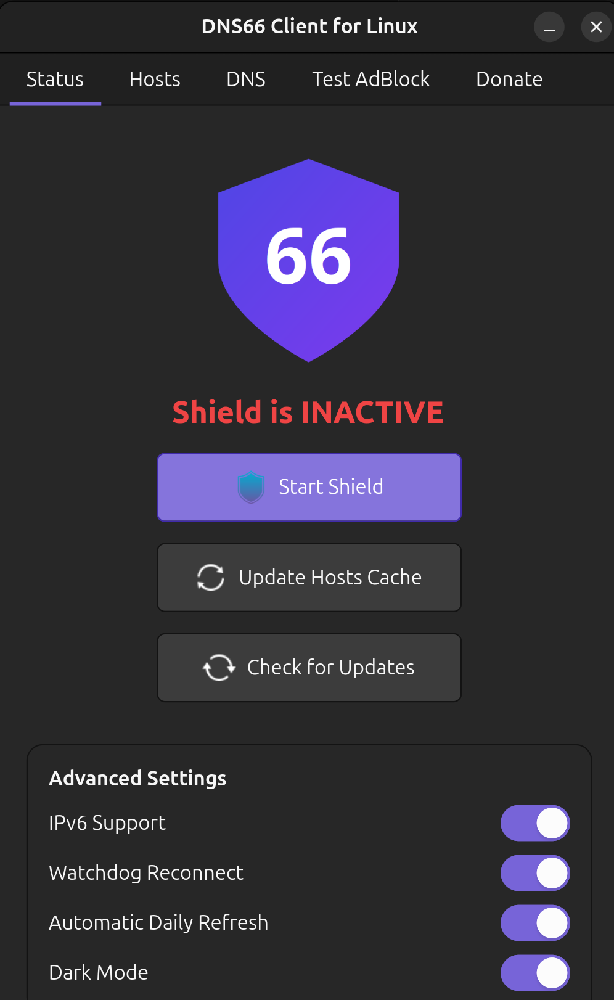
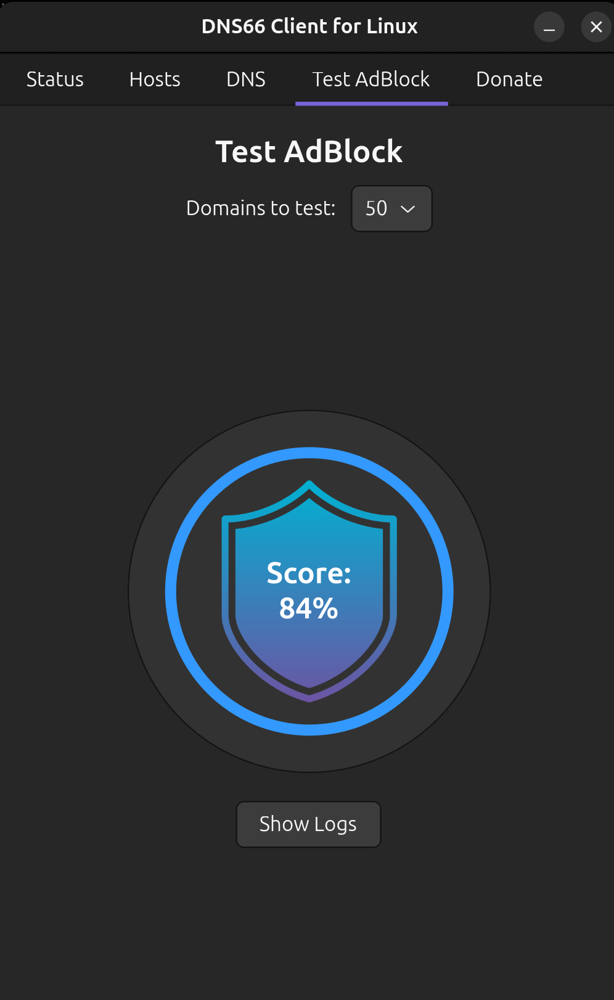

# DNS66 Client for Linux






A system-wide DNS Proxy and Adblocker designed natively for Linux, acting as a desktop port of the Android DNS66 app.

**Website:** [https://rickeydas.github.io/dns66-linux/](https://rickeydas.github.io/dns66-linux/)


> [!IMPORTANT]
> **Why this project is more relevant than ever:** With Google Chrome's transition to **Manifest V3** heavily restricting traditional browser based adblockers, DNS66 provides a robust alternative. Because it operates as a system-wide DNS proxy, it is completely immune to browser extension restrictions, allowing you to seamlessly block ads and trackers across your entire system, regardless of the browser you use.

## Features

- **Per-Host Rules:** Mark specific blocklists to act as "Allowlists" or "Ignore" them.
- **Automatic Background Refresh:** Automatically updates the blocklists daily via a background timer.
- **IPv6 Support & Watchdog:** Full IPv6 filtering support with self-recovery watchdog logic.

## Installation

You can build and install the application directly via the native Debian package installer:

```bash
# 1. Build the .deb package
./build_deb.sh

# 2. Install the package
sudo dpkg -i dns66-client_*.deb
# (Alternatively, use: sudo apt install ./dns66-client_*.deb)
```

## Usage

Once installed, simply search for **DNS66 Client for Linux** in your desktop environment's application launcher (GNOME, KDE, etc.).
The UI will prompt for authentication (via `pkexec`) since managing system-wide DNS configurations requires elevated privileges.

## Architecture & Components

- **`ui.py`**: Python Tkinter UI for managing blocklists and host rules.
- **`dns_proxy.py`**: System-wide DNS proxy using `dnslib` to filter and intercept ad requests.
- **`systemd-resolved`**: Networking is intercepted at the `systemd-resolved` layer for safe, zero-touch blocking.

## Credits & Acknowledgements

- **DNS66 for Android:** This project is a Linux desktop port inspired by the amazing [DNS66 project for Android](https://github.com/julian-klode/dns66) created by Julian Klode.
- **StevenBlack Hosts:** The default adblocking lists used by this client are generously maintained by the [StevenBlack/hosts](https://github.com/StevenBlack/hosts) project.

## Calling All Contributors! 🚀

We want to make **DNS66 Client for Linux** the ultimate, lightweight, and native system-wide adblocking solution for the Linux desktop! Whether you are a seasoned Python developer, a UI/UX designer, or just someone who loves squashing bugs and writing documentation, **your help is incredibly valuable to us!**

Here are some ways you can contribute and help make this project a massive success:

- **Code:** Help us improve the DNS proxy (`dns_proxy.py`), optimize performance, or add new features to the GTK4 UI (`ui.py`).
- **Testing:** Run the app on different Linux distributions and report bugs or broken features.
- **Documentation:** Improve this README, write tutorials, or add inline code comments.
- **Design:** Help us refine the UI or create better icons and assets.

### How to get started

1. Fork the repository.
2. Create your feature branch (`git checkout -b feature/AmazingFeature`).
3. Commit your changes (`git commit -m 'Add some AmazingFeature'`).
4. Push to the branch (`git push origin feature/AmazingFeature`).
5. Open a Pull Request!

We are building a welcoming and inclusive community. Let's make the Linux desktop ad-free together!

## Support the Project 💖

If you love DNS66 Client for Linux and want to support its continued development, consider making a donation! Your support helps keep the project alive and actively maintained.

**UPI ID:** `karam.shine-2@oksbi`


